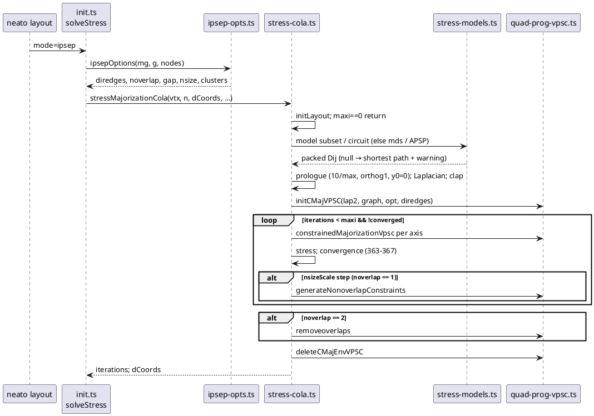
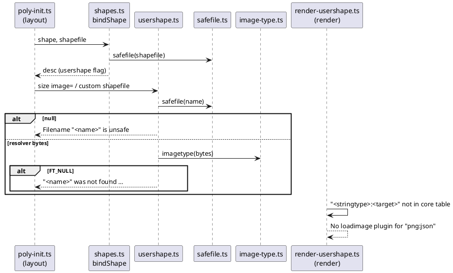

# Data flow

## Constrained ipsep after T10

```plantuml
@startuml
participant "neato layout" as L
participant "init.ts\nsolveStress" as S
participant "ipsep-opts.ts" as O
participant "stress-cola.ts" as C
participant "stress-models.ts" as M
participant "quad-prog-vpsc.ts" as Q
L -> S : mode=ipsep
S -> O : ipsepOptions(mg, g, nodes)
O --> S : diredges, noverlap, gap, nsize, clusters
S -> C : stressMajorizationCola(vtx, n, dCoords, …)
C -> C : initLayout; maxi==0 return
C -> M : model subset / circuit (else mds / APSP)
M --> C : packed Dij (null → shortest path + warning)
C -> C : prologue (10/max, orthog1, y0=0); Laplacian; clap
C -> Q : initCMajVPSC(lap2, graph, opt, diredges)
loop iterations < maxi && !converged
  C -> Q : constrainedMajorizationVpsc per axis
  C -> C : stress; convergence (363-367)
  alt nsizeScale step (noverlap == 1)
    C -> Q : generateNonoverlapConstraints
  end
end
alt noverlap == 2
  C -> Q : removeoverlaps
end
C -> Q : deleteCMajEnvVPSC
C --> S : iterations; dCoords
@enduml
```

## Node image warnings after T2, T6 and T9

```plantuml
@startuml
participant "poly-init.ts\n(layout)" as P
participant "shapes.ts\nbindShape" as B
participant "usershape.ts" as U
participant "safefile.ts" as F
participant "image-type.ts" as T
participant "render-usershape.ts\n(render)" as R
P -> B : shape, shapefile
B -> F : safefile(shapefile)
B --> P : desc (usershape flag)
P -> U : size image= / custom shapefile
U -> F : safefile(name)
alt null
  U --> P : Filename "<name>" is unsafe
else resolver bytes
  U -> T : imagetype(bytes)
  alt FT_NULL
    U --> P : "<name>" was not found …
  end
end
R -> R : "<stringtype>:<target>" not in core table
R --> R : No loadimage plugin for "png:json"
@enduml
```
