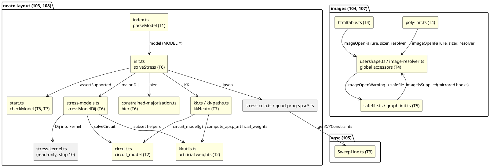

# Component map: part 8

Components touched by items 103–108 and how they call each other. Shaded = modified.

```plantuml
@startuml
skinparam componentStyle rectangle
package "neato layout (103, 108)" {
  [index.ts\nparseModel (T1)] as IDX #LightYellow
  [init.ts\nsolveStress (T6)] as INIT #LightYellow
  [start.ts\ncheckModel (T6, T7)] as START #LightYellow
  [stress-models.ts\nstressModelDij (T6)] as SM #LightYellow
  [constrained-majorization.ts\nhier (T6)] as CM #LightYellow
  [kk.ts / kk-paths.ts\nkkNeato (T7)] as KK #LightYellow
  [kkutils.ts\nartificial weights (T2)] as KKU #LightYellow
  [circuit.ts\ncircuit_model (T2)] as CIR #LightYellow
  [stress-kernel.ts\n(read-only, stop 10)] as SK
  [stress-cola.ts / quad-prog-vpsc*.ts] as COLA
}
package "vpsc (105)" {
  [SweepLine.ts (T3)] as SWL #LightYellow
}
package "images (104, 107)" {
  [poly-init.ts (T4)] as PI #LightYellow
  [htmltable.ts (T4)] as HT #LightYellow
  [usershape.ts / image-resolver.ts\nglobal accessors (T4)] as US #LightYellow
  [safefile.ts / graph-init.ts (T5)] as SF #LightYellow
}
IDX --> INIT : model (MODEL_*)
INIT --> START : assertSupported
INIT --> SM : major Dij
INIT --> CM : hier
INIT --> KK : KK
INIT --> COLA : ipsep
SM --> SK : Dij into kernel
SM --> KKU : subset helpers
SM --> CIR : solveCircuit
KK --> KKU : compute_apsp_artificial_weights
KK --> CIR : circuit_model(g)
COLA --> SWL : genX/YConstraints
PI --> US : imageOpenFailure, sizer, resolver
HT --> US : imageOpenFailure, sizer, resolver
US --> SF : imageOpenWarning → safefile
SF --> US : imageIsSupplied(mirrored hooks)
@enduml
```
