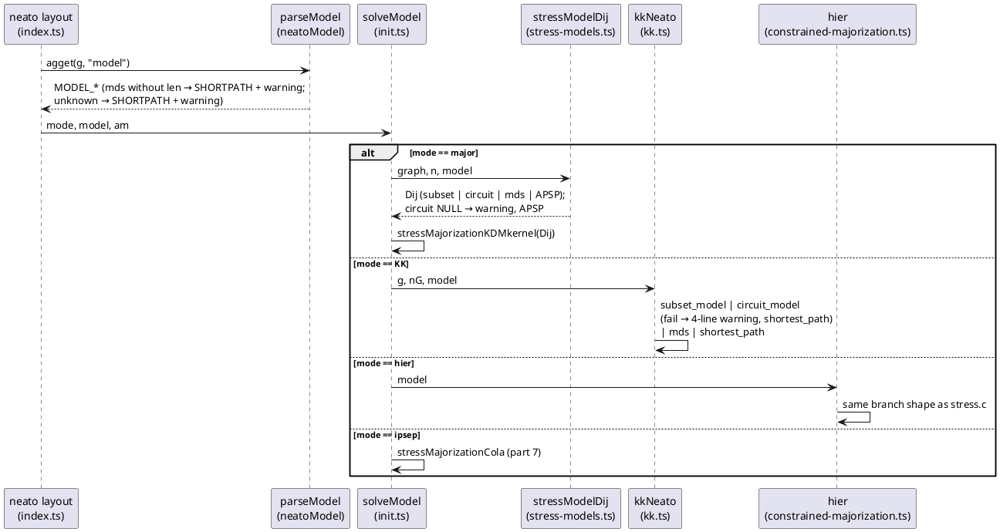
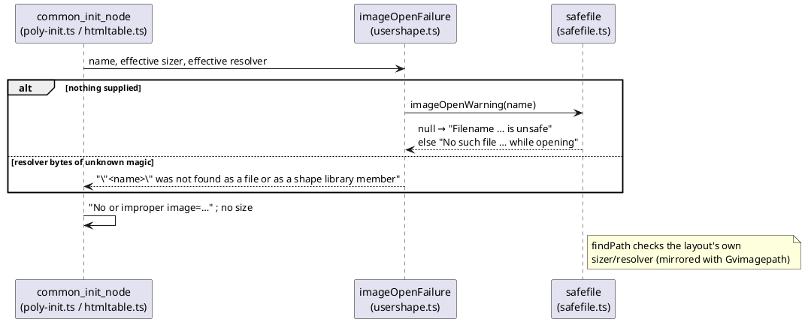

# Data flow: model selection (103, 108)

How a neato layout's `model` reaches each solver after part 8.

```plantuml
@startuml
participant "neato layout\n(index.ts)" as L
participant "parseModel\n(neatoModel)" as P
participant "solveModel\n(init.ts)" as S
participant "stressModelDij\n(stress-models.ts)" as D
participant "kkNeato\n(kk.ts)" as K
participant "hier\n(constrained-majorization.ts)" as H
L -> P : agget(g, "model")
P --> L : MODEL_* (mds without len → SHORTPATH + warning;\nunknown → SHORTPATH + warning)
L -> S : mode, model, am
alt mode == major
  S -> D : graph, n, model
  D --> S : Dij (subset | circuit | mds | APSP);\ncircuit NULL → warning, APSP
  S -> S : stressMajorizationKDMkernel(Dij)
else mode == KK
  S -> K : g, nG, model
  K -> K : subset_model | circuit_model\n(fail → 4-line warning, shortest_path)\n| mds | shortest_path
else mode == hier
  S -> H : model
  H -> H : same branch shape as stress.c
else mode == ipsep
  S -> S : stressMajorizationCola (part 7)
end
@enduml
```

# Data flow: image open at layout (104, 107)

```plantuml
@startuml
participant "common_init_node\n(poly-init.ts / htmltable.ts)" as N
participant "imageOpenFailure\n(usershape.ts)" as F
participant "safefile\n(safefile.ts)" as SF
N -> F : name, effective sizer, effective resolver
alt nothing supplied
  F -> SF : imageOpenWarning(name)
  SF --> F : null → "Filename … is unsafe"\nelse "No such file … while opening"
else resolver bytes of unknown magic
  F --> N : "\"<name>\" was not found as a file or as a shape library member"
end
N -> N : "No or improper image=…" ; no size
note right of SF : findPath checks the layout's own\nsizer/resolver (mirrored with Gvimagepath)
@enduml
```
