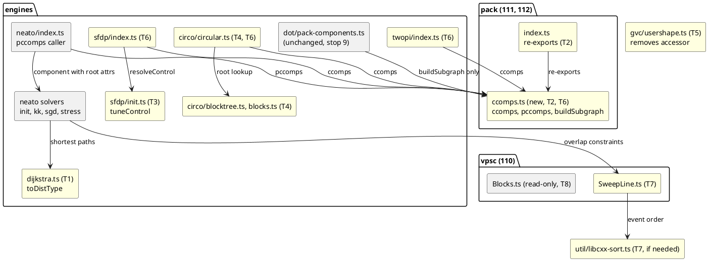

# Component map: part 9

Components touched by items 109–113 and the circo root fix, and how they call each other. Shaded = modified.

```plantuml
@startuml
skinparam componentStyle rectangle
package "pack (111, 112)" {
  [ccomps.ts (new, T2, T6)\nccomps, pccomps, buildSubgraph] as CC #LightYellow
  [index.ts\nre-exports (T2)] as PI #LightYellow
}
package "engines" {
  [neato/index.ts\npccomps caller] as NEATO
  [neato solvers\ninit, kk, sgd, stress] as SOLV
  [dijkstra.ts (T1)\ntoDistType] as DIJ #LightYellow
  [twopi/index.ts (T6)] as TWOPI #LightYellow
  [sfdp/index.ts (T6)] as SFDP #LightYellow
  [sfdp/init.ts (T3)\ntuneControl] as SFI #LightYellow
  [circo/circular.ts (T4, T6)] as CIRC #LightYellow
  [circo/blocktree.ts, blocks.ts (T4)] as BT #LightYellow
  [dot/pack-components.ts\n(unchanged, stop 9)] as DOT
}
package "vpsc (110)" {
  [SweepLine.ts (T7)] as SWL #LightYellow
  [Blocks.ts (read-only, T8)] as BLK
}
[util/libcxx-sort.ts (T7, if needed)] as SORT #LightYellow
[gvc/usershape.ts (T5)\nremoves accessor] as US #LightYellow
NEATO --> CC : pccomps
TWOPI --> CC : ccomps
SFDP --> CC : ccomps
CIRC --> CC : ccomps
DOT --> CC : buildSubgraph only
PI --> CC : re-exports
NEATO --> SOLV : component with root attrs
SOLV --> DIJ : shortest paths
SFDP --> SFI : resolveControl
CIRC --> BT : root lookup
SWL --> SORT : event order
SOLV --> SWL : overlap constraints
@enduml
```
