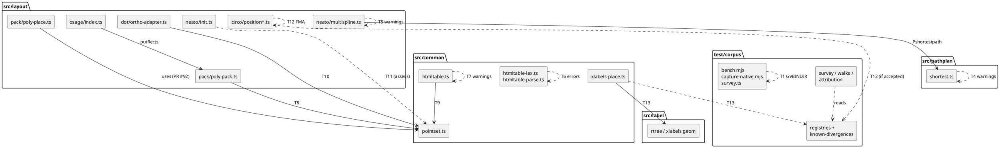

# Component map: what the mission touches

```plantuml
@startuml
skinparam componentStyle rectangle
package "src/common" {
  [pointset.ts] as PS
  [htmltable.ts] as HT
  [htmltable-lex.ts\nhtmltable-parse.ts] as HL
  [xlabels-place.ts] as XL
}
package "src/layout" {
  [pack/poly-pack.ts] as PP
  [pack/poly-place.ts] as PPL
  [dot/ortho-adapter.ts] as OA
  [neato/multispline.ts] as MS
  [neato/init.ts] as NI
  [circo/position*.ts] as CP
  [osage/index.ts] as OS
}
package "src/pathplan" {
  [shortest.ts] as SH
}
package "src/label" {
  [rtree / xlabels geom] as LB
}
package "test/corpus" {
  [survey / walks /\nattribution] as SV
  [bench.mjs\ncapture-native.mjs\nsurvey.ts] as SC
  [registries +\nknown-divergences] as RG
}
PPL --> PS : uses (PR #92)
PP --> PS : T8
HT --> PS : T9
OA --> PS : T10
NI ..> PS : T11 (assess)
OS --> PP : putRects
MS --> SH : Pshortestpath
SH ..> SH : T4 warnings
MS ..> MS : T5 warnings
HL ..> HL : T6 errors
HT ..> HT : T7 warnings
CP ..> CP : T12 FMA
XL --> LB : T13
SC ..> SC : T1 GVBINDIR
CP ..> RG : T12 (if accepted)
XL ..> RG : T13
SV ..> RG : reads
@enduml
```
