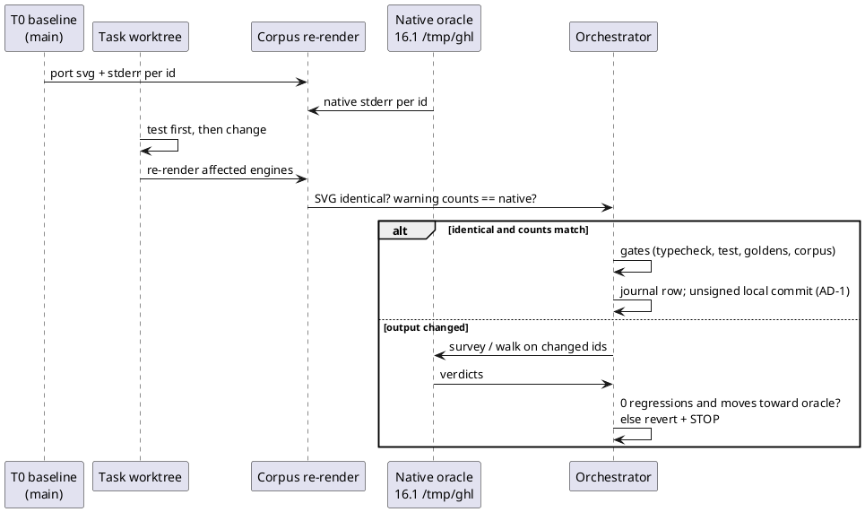
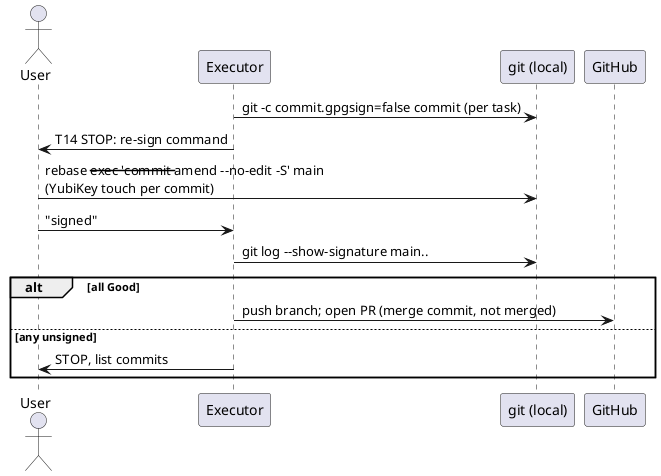

# Data flows

## Per-task verification

```plantuml
@startuml
participant "T0 baseline\n(main)" as B
participant "Task worktree" as W
participant "Corpus re-render" as R
participant "Native oracle\n16.1 /tmp/ghl" as N
participant Orchestrator as O
B -> R : port svg + stderr per id
N -> R : native stderr per id
W -> W : test first, then change
W -> R : re-render affected engines
R -> O : SVG identical? warning counts == native?
alt identical and counts match
  O -> O : gates (typecheck, test, goldens, corpus)
  O -> O : journal row; unsigned local commit (AD-1)
else output changed
  O -> N : survey / walk on changed ids
  N -> O : verdicts
  O -> O : 0 regressions and moves toward oracle?\nelse revert + STOP
end
@enduml
```

## Signing and handoff (AD-1)

```plantuml
@startuml
actor User
participant Executor as E
participant "git (local)" as G
participant GitHub as H
E -> G : git -c commit.gpgsign=false commit (per task)
E -> User : T14 STOP: re-sign command
User -> G : rebase --exec 'commit --amend --no-edit -S' main\n(YubiKey touch per commit)
User -> E : "signed"
E -> G : git log --show-signature main..
alt all Good
  E -> H : push branch; open PR (merge commit, not merged)
else any unsigned
  E -> User : STOP, list commits
end
@enduml
```
