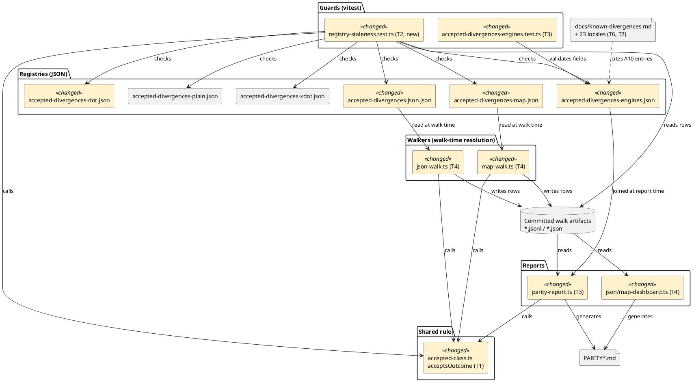

# Component map — registry-faults-staleness

Proposed state. Shaded components change in this mission; the T-ids name the
task that changes each one.

```plantuml
@startuml
skinparam componentStyle rectangle
skinparam component {
  BackgroundColor<<changed>> #FFF2CC
}

package "Registries (JSON)" {
  [accepted-divergences-engines.json] <<changed>> as REng
  [accepted-divergences-json.json] <<changed>> as RJson
  [accepted-divergences-map.json] <<changed>> as RMap
  [accepted-divergences-dot.json] <<changed>> as RDot
  [accepted-divergences-plain.json] as RPlain
  [accepted-divergences-xdot.json] as RXdot
}

package "Shared rule" {
  [accepted-class.ts\nacceptsOutcome (T1)] <<changed>> as Rule
}

package "Walkers (walk-time resolution)" {
  [json-walk.ts (T4)] <<changed>> as JW
  [map-walk.ts (T4)] <<changed>> as MW
}

package "Reports" {
  [parity-report.ts (T3)] <<changed>> as PR
  [json/map-dashboard.ts (T4)] <<changed>> as Dash
}

package "Guards (vitest)" {
  [registry-staleness.test.ts (T2, new)] <<changed>> as Stale
  [accepted-divergences-engines.test.ts (T3)] <<changed>> as EngTest
}

database "Committed walk artifacts\n*.jsonl / *.json" as Art
file "PARITY*.md" as Pages
file "docs/known-divergences.md\n+ 23 locales (T6, T7)" as Docs

JW --> Rule : calls
MW --> Rule : calls
PR --> Rule : calls
Stale --> Rule : calls
RJson --> JW : read at walk time
RMap --> MW : read at walk time
JW --> Art : writes rows
MW --> Art : writes rows
REng --> PR : joined at report time
Art --> PR : reads
Art --> Dash : reads
PR --> Pages : generates
Dash --> Pages : generates
Stale --> Art : reads rows
Stale --> REng : checks
Stale --> RJson : checks
Stale --> RMap : checks
Stale --> RPlain : checks
Stale --> RDot : checks
Stale --> RXdot : checks
EngTest --> REng : validates fields
Docs ..> REng : cites A10 entries
@enduml
```
