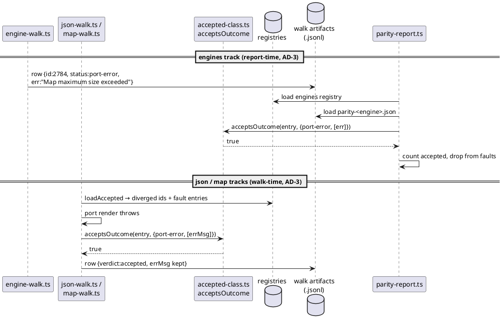
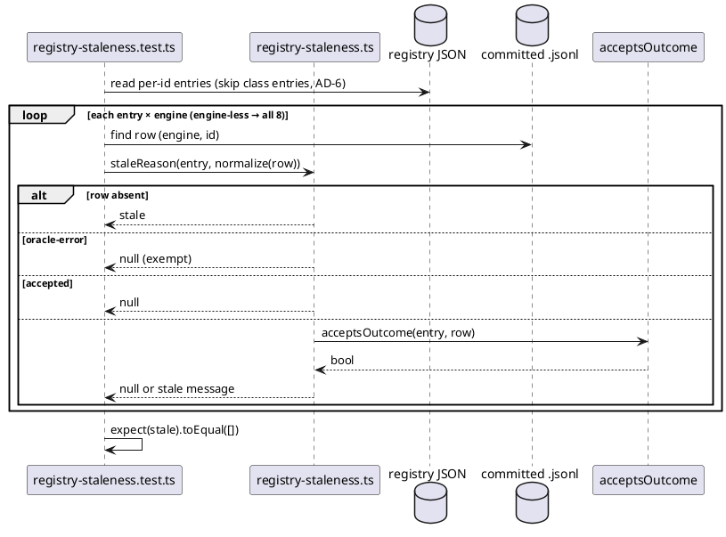

# Data flow — registry-faults-staleness

## Fault acceptance for 2784 (proposed)

How one A10 row becomes `accepted` on each track.

```plantuml
@startuml
participant "engine-walk.ts" as EW
participant "json-walk.ts /\nmap-walk.ts" as FW
participant "accepted-class.ts\nacceptsOutcome" as Rule
database "registries" as Reg
database "walk artifacts\n(.jsonl)" as Art
participant "parity-report.ts" as PR

== engines track (report-time, AD-3) ==
EW -> Art : row {id:2784, status:port-error,\nerr:"Map maximum size exceeded"}
PR -> Reg : load engines registry
PR -> Art : load parity-<engine>.json
PR -> Rule : acceptsOutcome(entry, {port-error, [err]})
Rule --> PR : true
PR -> PR : count accepted, drop from faults

== json / map tracks (walk-time, AD-3) ==
FW -> Reg : loadAccepted → diverged ids + fault entries
FW -> FW : port render throws
FW -> Rule : acceptsOutcome(entry, {port-error, [errMsg]})
Rule --> FW : true
FW -> Art : row {verdict:accepted, errMsg kept}
@enduml
```

## Staleness check (proposed)

```plantuml
@startuml
participant "registry-staleness.test.ts" as T
participant "registry-staleness.ts" as H
database "registry JSON" as Reg
database "committed .jsonl" as Art
participant "acceptsOutcome" as Rule

T -> Reg : read per-id entries (skip class entries, AD-6)
loop each entry × engine (engine-less → all 8)
  T -> Art : find row (engine, id)
  T -> H : staleReason(entry, normalize(row))
  alt row absent
    H --> T : stale
  else oracle-error
    H --> T : null (exempt)
  else accepted
    H --> T : null
  else
    H -> Rule : acceptsOutcome(entry, row)
    Rule --> H : bool
    H --> T : null or stale message
  end
end
T -> T : expect(stale).toEqual([])
@enduml
```
