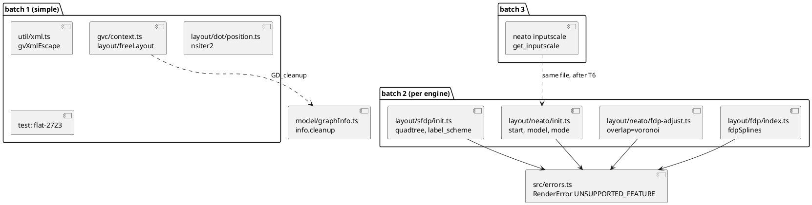

# Component map

```plantuml
@startuml
package "batch 1 (simple)" {
  [gvc/context.ts\nlayout/freeLayout] as Ctx
  [util/xml.ts\ngvXmlEscape] as Xml
  [layout/dot/position.ts\nnsiter2] as Pos
  [test: flat-2723] as T2723
}
package "batch 2 (per engine)" {
  [layout/sfdp/init.ts\nquadtree, label_scheme] as Sfdp
  [layout/neato/init.ts\nstart, model, mode] as NInit
  [layout/neato/fdp-adjust.ts\noverlap=voronoi] as Adj
  [layout/fdp/index.ts\nfdpSplines] as Fdp
}
package "batch 3" {
  [neato inputscale\nget_inputscale] as Isc
}
[src/errors.ts\nRenderError UNSUPPORTED_FEATURE] as Err
Sfdp --> Err
NInit --> Err
Adj --> Err
Fdp --> Err
Isc ..> NInit : same file, after T6
Ctx ..> [model/graphInfo.ts\ninfo.cleanup] : GD_cleanup
@enduml
```
