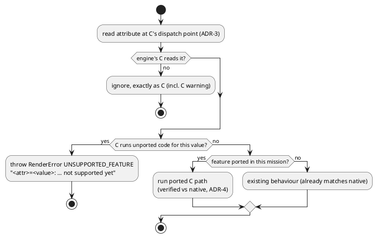

# Data flow: attribute → engine decision

```plantuml
@startuml
start
:read attribute at C's dispatch point (ADR-3);
if (engine's C reads it?) then (no)
  :ignore, exactly as C (incl. C warning);
  stop
endif
if (C runs unported code for this value?) then (yes)
  :throw RenderError UNSUPPORTED_FEATURE\n"<attr>=<value>: ... not supported yet";
  stop
else (no)
  if (feature ported in this mission?) then (yes)
    :run ported C path\n(verified vs native, ADR-4);
  else (no)
    :existing behaviour (already matches native);
  endif
endif
stop
@enduml
```
