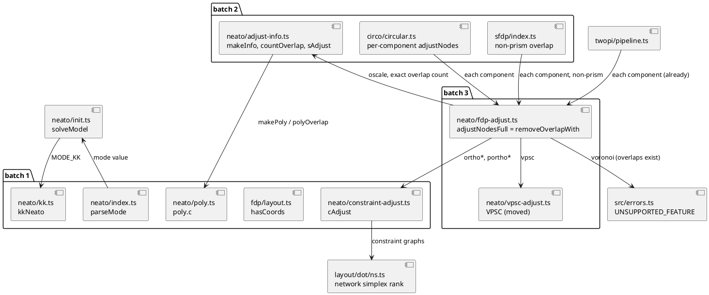

# Component map

```plantuml
@startuml
package "batch 1" {
  [neato/poly.ts\npoly.c] as Poly
  [fdp/layout.ts\nhasCoords] as Coords
  [neato/index.ts\nparseMode] as Mode
  [neato/kk.ts\nkkNeato] as KK
  [neato/constraint-adjust.ts\ncAdjust] as CAdj
}
package "batch 2" {
  [neato/adjust-info.ts\nmakeInfo, countOverlap, sAdjust] as Info
  [circo/circular.ts\nper-component adjustNodes] as Circo
  [sfdp/index.ts\nnon-prism overlap] as Sfdp
}
package "batch 3" {
  [neato/fdp-adjust.ts\nadjustNodesFull = removeOverlapWith] as Disp
  [neato/vpsc-adjust.ts\nVPSC (moved)] as Vpsc
}
[neato/init.ts\nsolveModel] as Init
[layout/dot/ns.ts\nnetwork simplex rank] as NS
[src/errors.ts\nUNSUPPORTED_FEATURE] as Err

Mode --> Init : mode value
Init --> KK : MODE_KK
Info --> Poly : makePoly / polyOverlap
CAdj --> NS : constraint graphs
Disp --> Info : oscale, exact overlap count
Disp --> CAdj : ortho*, portho*
Disp --> Vpsc : vpsc
Disp --> Err : voronoi (overlaps exist)
Circo --> Disp : each component
Sfdp --> Disp : each component, non-prism
[twopi/pipeline.ts] --> Disp : each component (already)
@enduml
```
