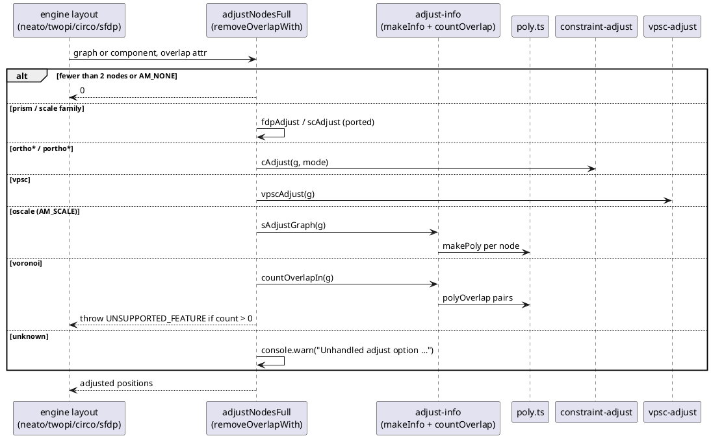
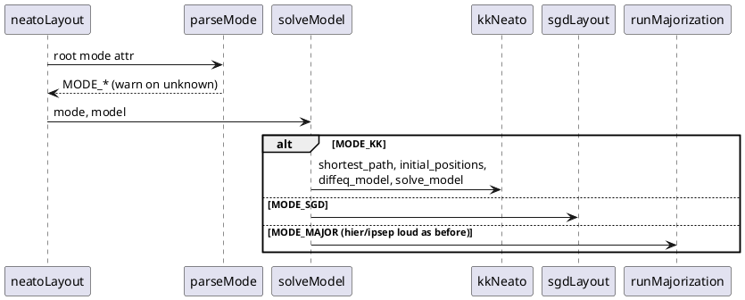

# Data flow: overlap removal after batch 3

```plantuml
@startuml
participant "engine layout\n(neato/twopi/circo/sfdp)" as Eng
participant "adjustNodesFull\n(removeOverlapWith)" as Disp
participant "adjust-info\n(makeInfo + countOverlap)" as Info
participant "poly.ts" as Poly
participant "constraint-adjust" as C
participant "vpsc-adjust" as V

Eng -> Disp : graph or component, overlap attr
alt fewer than 2 nodes or AM_NONE
  Disp --> Eng : 0
else prism / scale family
  Disp -> Disp : fdpAdjust / scAdjust (ported)
else ortho* / portho*
  Disp -> C : cAdjust(g, mode)
else vpsc
  Disp -> V : vpscAdjust(g)
else oscale (AM_SCALE)
  Disp -> Info : sAdjustGraph(g)
  Info -> Poly : makePoly per node
else voronoi
  Disp -> Info : countOverlapIn(g)
  Info -> Poly : polyOverlap pairs
  Disp --> Eng : throw UNSUPPORTED_FEATURE if count > 0
else unknown
  Disp -> Disp : console.warn("Unhandled adjust option …")
end
Disp --> Eng : adjusted positions
@enduml
```

# Data flow: neato mode dispatch after batch 1

```plantuml
@startuml
participant "neatoLayout" as N
participant "parseMode" as M
participant "solveModel" as S
participant "kkNeato" as K
participant "sgdLayout" as G
participant "runMajorization" as J
N -> M : root mode attr
M --> N : MODE_* (warn on unknown)
N -> S : mode, model
alt MODE_KK
  S -> K : shortest_path, initial_positions,\ndiffeq_model, solve_model
else MODE_SGD
  S -> G
else MODE_MAJOR (hier/ipsep loud as before)
  S -> J
end
@enduml
```
