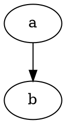

# API

See [the clean page](/guide/clean) and the [parity report](/parity#top).
Reference: [types](/reference/types), , [logo](/logo.svg).
Inline code `[x](/guide/api)` is ignored.

Click Export SVG to save.

<Playground />



````md
```nested
[x](/guide/api)
```
````
